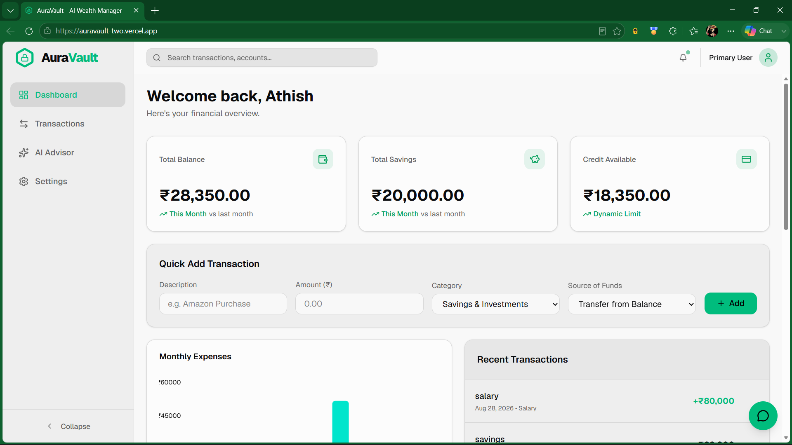
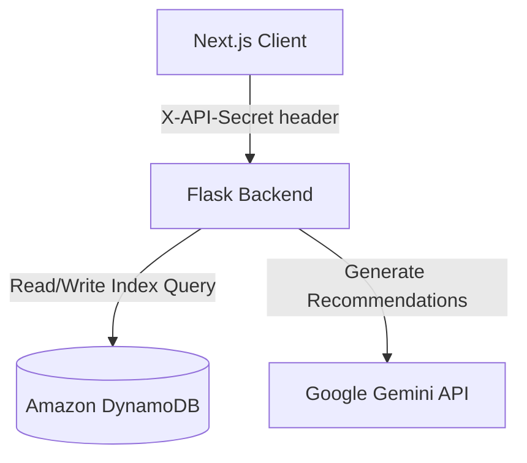

# AuraVault AI

AuraVault AI is a personal wealth and expense tracker featuring an integrated AI financial advisor powered by Google Gemini.



## Features

- **Transaction Ledger & Dashboard**: Real-time spending tracker, categorization, and ledger management.
- **Statement Parsing & Rule-Based Categorization**: Extracts transaction lines from uploaded PDF, CSV, or text statements using `pdfplumber` text extraction and regex pattern matching for dates, descriptions, and amounts. Transactions are categorized automatically using keyword rules (e.g. "rent" → Housing, "salary" → Salary, "atm" → Cash).
- **AI Financial Advisor Chat**: Conversational financial advisor powered by Google Gemini (`gemini-3.5-flash`) with live context access to your current balance, category-wise spending breakdown, and recent transactions.
- **Visual Analytics**: Interactive charts showing expense breakdowns, monthly trends, and categories.

## Architecture

AuraVault is built as a decoupled client-server application:
- **Frontend (Next.js)**: A responsive client built with React, TypeScript, and Tailwind CSS. It communicates with the Flask backend, passing requests gated by a shared secret header (`X-API-Secret`).
- **Backend (Flask)**: A lightweight Python REST API that parses statements using `pdfplumber` and regex, applies keyword categorization rules, stores financial history in DynamoDB, and queries the Google Gemini API for financial advisor chat responses.



## Tech Stack

- **Frontend**: Next.js (App Router), React, TypeScript, Tailwind CSS, Radix UI, Lucide Icons, pnpm
- **Backend**: Flask, Boto3 (DynamoDB client), pdfplumber, Werkzeug, python-dotenv
- **AI Engine**: Google Gemini API (`google-generativeai` / `gemini-3.5-flash` for Advisor Chat)
- **Database**: Amazon DynamoDB (indexed for query-based single-user operations)
- **Deployment**: Vercel (Frontend), Render (Backend)

---

## Required Environment Variables

### Backend (ai-backend/)

| Variable Name | Description | Example / Format |
|---|---|---|
| `API_SECRET` | Shared secret token verified via custom header `X-API-Secret`. | `your_secure_random_string` |
| `API_KEY` | Google Gemini API access key. | `AIzaSy...` |
| `AWS_ACCESS_KEY_ID` | Amazon Web Services access key. | `AKIA...` |
| `AWS_SECRET_ACCESS_KEY` | Amazon Web Services secret access key. | `...` |
| `ALLOWED_ORIGIN` | Commas-separated list of CORS origins allowed to access the API. | `https://auravault-two.vercel.app` |
| `FLASK_DEBUG` | Enables flask debug mode when set to `true`. | `false` |

### Frontend (auravault/)

| Variable Name | Description | Example / Format |
|---|---|---|
| `NEXT_PUBLIC_API_URL` | Base endpoint URL of the Flask backend. | `http://localhost:5000` |
| `NEXT_PUBLIC_API_SECRET` | Shared secret matching the backend's `API_SECRET`. | `your_secure_random_string` |

---

## Local Setup

### Prerequisite
Ensure you have `Node.js` (v18+), `pnpm` (v11+), and `Python` (3.12+) installed.

### 1. Setup Backend (`ai-backend/`)
1. Navigate to the backend directory:
   ```bash
   cd ai-backend
   ```
2. Create and activate a Python virtual environment:
   ```bash
   python -m venv venv
   # On Windows:
   venv\Scripts\activate
   # On macOS/Linux:
   source venv/bin/activate
   ```
3. Install dependencies:
   ```bash
   pip install -r requirements.txt
   ```
4. Copy the environment template and fill in your values:
   ```bash
   cp .env.example .env
   ```
5. Run the Flask server (runs on port 5000 by default):
   ```bash
   python app.py
   ```

### 2. Setup Frontend (`auravault/`)
1. Navigate to the frontend directory:
   ```bash
   cd auravault
   ```
2. Install Node dependencies:
   ```bash
   pnpm install
   ```
3. Copy the environment template and fill in your values:
   ```bash
   cp .env.example .env.local
   ```
4. Start the development server (runs on port 3000 by default):
   ```bash
   pnpm dev
   ```

---

## Security Notes

> [!IMPORTANT]
> **Single-User Gate Safeguard**:
> This application currently runs in single-user mode. Data privacy is enforced by matching a shared-secret header (`X-API-Secret`) sent by the client against the server's configured `API_SECRET`. It does not support session authentication, passwords, or separate user accounts.
> 
> If you plan to extend this codebase to support multiple users, you **MUST** replace the shared-secret gate with a secure multi-user session authenticator (such as JWT tokens via Clerk, Auth0, or custom OAuth) and dynamically resolve the `userId` claim from the validated tokens.

---

## Live Demo

- **Hosted Application**: https://auravault-two.vercel.app
- **API Backend Service**: https://auravault-backend.onrender.com
